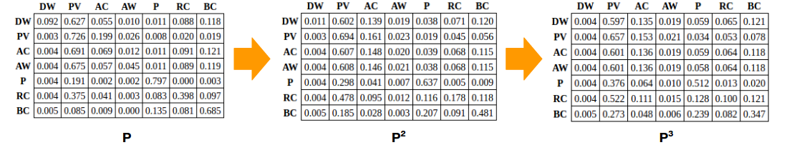

# SWYM CORPORATION

## CAPSTONE PRESENTATION
The CRISP-DM workflow and results for this project were presented at the Galvanize Capstone Showcase on March 30, 2017. Here is a [link to the slides](https://docs.google.com/presentation/d/1RgEDtY8h6ofiUyVXg3AkmAJZB5d05S5E-ppPsC_aL20/edit?usp=sharing) used in the presentation.

## BUSINESS UNDERSTANDING
Swym is a company which aims to help E-Commerce brands craft more seamless and personalized experiences for their shoppers. They are built on the Shopify platform for online stores, and add functionality to those sites in the form of applications such as Wishlist+ and Watchlist. The main goal of this project was to use machine learning algorithms to accurately model customer journeys based on available user context, and to leverage that predictive power to further optimize the online shopping experience for individual users.

## DATA UNDERSTANDING
Swym's extensive data was made accessible to me for querying via Azure SQL. I worked primarily with two large datasets:

* Sessions - A session begins when a user accesses a Shopify online store, and ends once the user is inactive for 30 minutes or more. Each row in this table represents one user action within the given session. This can also be thought of as any change in the URL.

* Devices - Provides additional metadata on the device used to access a Shopify site.

There are thousands of Shopify stores which make use of Swym's products, but I limited the scope of my capstone project to just a few select medium-sized providers.

## DATA PREPARATION
The bulk of my work on this project went into cleaning and converting the available data into a usable format, as well as into engineering new features that may potentially be informative in identifying a customer's next action within the current session. Variables derived include:

* Seasonality indicators for day of week and hour of day
* URL of site customer was referred from
* Device type and operating system
* Elapsed time since beginning of session and since last user action
* Prior actions taken by user in current session
* Access history for the user on each Shopify site
* Tf-idf vectors for page title and product category

I developed a comprehensive Python class named "Swymify" to accomplish all of the above. The class also includes methods to fit and evaluate various machine learning models.

 

## MODELING
Models were trained on data through the full month of February 2017 and tested on data from the same providers for the first week of March 2017. Prediction accuracy was the preferred measure of success. I evaluated three different classification techniques for predicting a Swym user's next action: Random Forest, Gradient Boosting, and Support Vector Machine. I tuned the hyperparameters for each of these three models via Grid Search, and compared them using 5-fold cross validation on the training data. The training accuracies with one prior action included are as follows:

* Random Forest: 71.7%
* Gradient Boosting: 70.8%
* Support Vector Machine: 66.7%

I selected the Random Forest Classifier as my final model both because it had the highest accuracy on the training data and because it's processing speed was much faster than that of the other two algorithms.

The baseline accuracy I was attempting to outperform was the proportion of user actions which belonged to the majority class, Page Views. This action made up about 65.4% of the training data. Below is a chart displaying the actual user action distribution for the training data compared to that predicted by the Random Forest Classifier.

 

## EVALUATION
Page Views made up approximately 74.8% of the March testing data. Applying the Random Forest Classifier to the testing dataset yielded the following the following accuracies:

 

 

Note that the test accuracies steadily increase as additional prior actions are included as features in the trained model. This pattern holds through six prior actions for the testing data. I stopped there because considering more past actions was computationally expensive, and because I felt that the data was too sparse past that point to make the results meaningful. The highest test accuracy I was able to obtain was 83.6%, which is an improvement of 8.8% over baseline.

## MARKOV CHAINS
One very useful output of the model is a Markov Chain, which can be used to chart a user's likely sequence of actions in a given session. The Markov Chain transition probabilities can be initiated using the probabilities from the Random Forest Classifier, based on a user's starting session information and any number of prior actions. Below is the first order Markov transition matrix for one example user pulled from the training dataset.

 

## NEXT STEPS
Possible next steps include:

* Deployment: Return the model to Swym in the most useful or preferred format.
* Scaling Up: Build the model on additional months or providers for enhanced accuracy.
* Product Specificity: Narrow down the outputs of the model to be specific to certain products, as opposed to user actions in general (i.e. probability of making a purchase vs. probability of purchasing a particular item).
* Additional Features: Definitely more potentially predictive variables to be derived from the data. For instance, I would have liked to explore whether the images displayed or text descriptions on various Shopify sites affected the likelihood of certain user actions such as purchasing.
